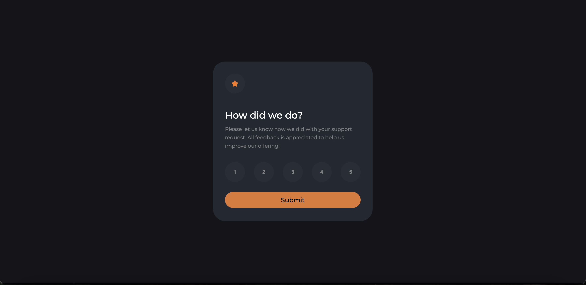
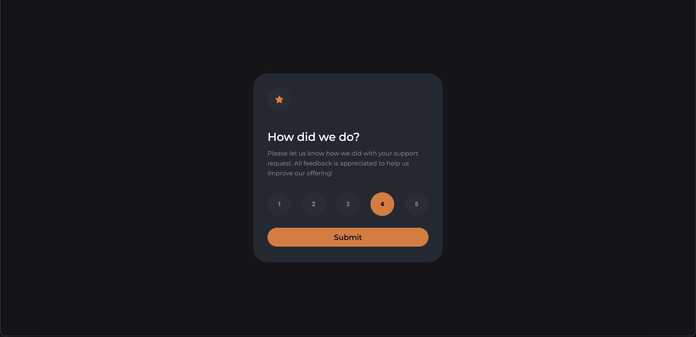
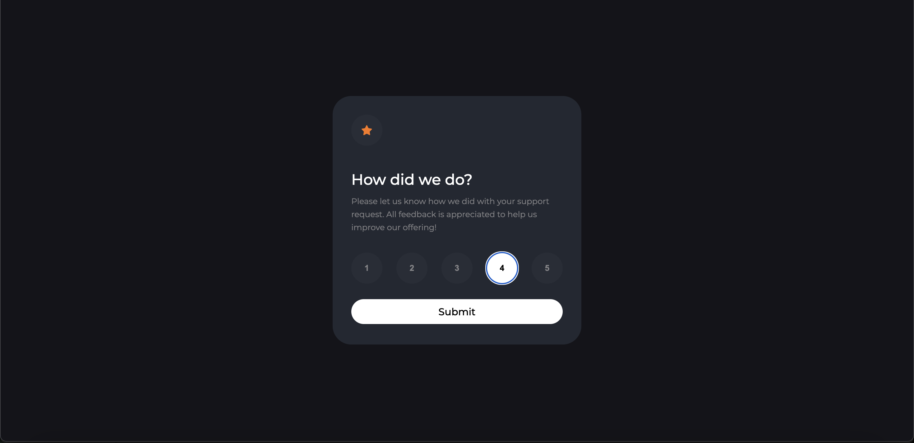
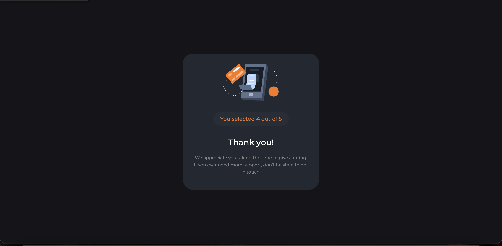

# Frontend Mentor - Interactive rating component solution

This is a solution to the [Interactive rating component challenge on Frontend Mentor](https://www.frontendmentor.io/challenges/interactive-rating-component-koxpeBUmI). Frontend Mentor challenges help you improve your coding skills by building realistic projects. 

## Table of contents

- [Overview](#overview)
  - [The challenge](#the-challenge)
  - [Screenshot](#screenshot)
  - [Links](#links)
- [My process](#my-process)
  - [Built with](#built-with)
  - [What I learned](#what-i-learned)
- [Author](#author)


## Overview

### The challenge

Users should be able to:

- View the optimal layout for the app depending on their device's screen size
- See hover states for all interactive elements on the page
- Select and submit a number rating
- See the "Thank you" card state after submitting a rating

### Screenshot






### Links

- Solution URL: [Link](https://github.com/harshalvaidya10/Interactive-rating-component.git)
- Live Site URL: [Link](https://your-live-site-url.com)

## My process

### Built with

- Semantic and accessible HTML5 markup

- CSS Flexbox for layout and centering

- Custom CSS properties for consistent styling

- Vanilla JavaScript for dynamic behavior and event handling

- Dynamic UI updates using .innerHTML and event-driven programming

- Mobile-first responsive design approach

### What I learned

**1.Dynamic Content Update with ```.innerHTML```**

One of the key parts of this project was using JavaScript's ```.innerHTML``` property to dynamically replace the content inside a container after the user submitted their rating.

✅ Example:

```js
document.getElementById("box").innerHTML =
`
  <h2>Thank you!</h2>
  <p>You selected ${selectedRating} out of 5</p>
`;
```
**Takeaway:**

I understood how .innerHTML can be used to fully replace an element's content and how it parses HTML strings to update the DOM in real-time.


**2.Capturing Button Clicks without Forms**

Since I used ```<input type="button">```, I learned that buttons do not have a .checked property like radio buttons.

Instead, I needed to listen to click events and store the selected value separately.

✅ Example:

```js
let selectedRating = null;

const ratingButtons = document.querySelectorAll(".ratingButtons input");

ratingButtons.forEach(button => {
    button.addEventListener("click", function() {
        selectedRating = this.value;
    });
});
```
**Takeaway:**

I learned the importance of properly managing user interaction without relying on default form behaviors.

**3.Using Flexbox for Centering Elements**

I practiced how to use Flexbox for both horizontal and vertical centering of my rating card.

✅ Example:
```css
.container {
  display: flex;
  justify-content: center;
  align-items: center;
  height: 100vh;
}
```
**Takeaway:**

Flexbox made it much easier to create responsive, centered layouts without complicated manual positioning.

**4.Improving User Experience with Hover and Focus States**

I used hover and focus styles in CSS to make the rating buttons visually interactive.

✅ Example:

```css
.ratingButtons input:hover {
  background-color: rgb(225, 120, 50);
  color: black;
}

.ratingButtons input:focus {
  background-color: white;
  color: black;
}
```

**Takeaway:**

I learned how important small visual feedback is to improve user interaction and make the UI feel more responsive and polished.

## Author

- Frontend Mentor - [@harshalvaidya10](https://www.frontendmentor.io/profile/harshalvaidya10)

